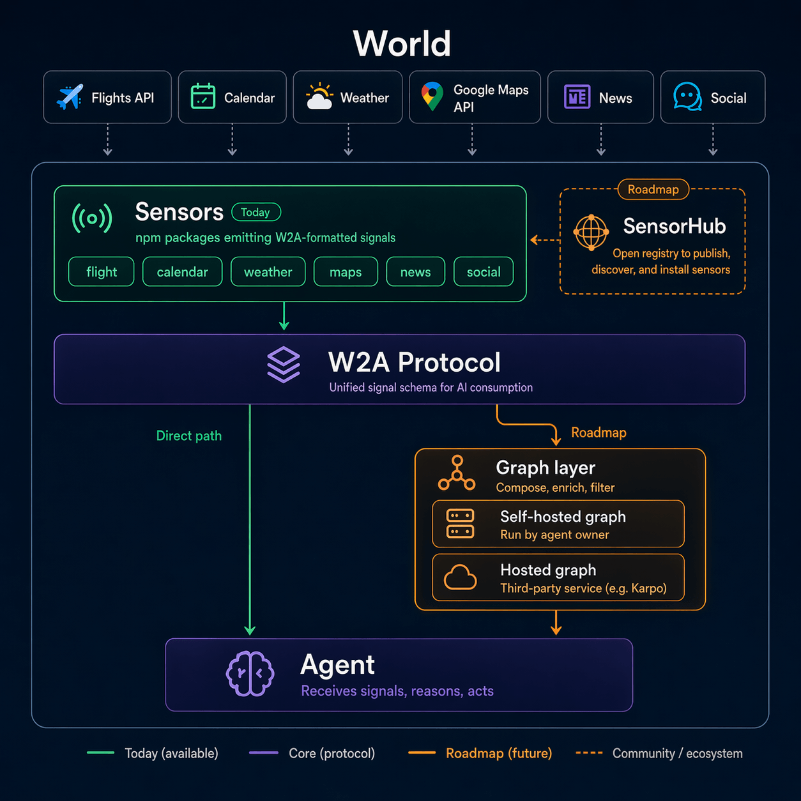

<p align="center">
  <i>Agents can't act on what they can't perceive.</i>
</p>

<p align="center">
  <a href="./LICENSE"></a>
  <a href="https://www.npmjs.com/org/world2agent"></a>
</p>

<p align="center">
  <a href="https://world2agent.ai">Website</a> ·
  <a href="#quick-start">Quick Start</a> ·
  <a href="#sensors">Sensors</a> ·
  <a href="https://world2agent.ai/hub">SensorHub</a> ·
  <a href="./docs">Docs</a> ·
  <a href="#community">Community</a>
</p>

<!-- Concept Video -->
<p align="center">
  <a href="https://world2agent.ai/assets/promo-w2a.mp4">
    Watch the W2A Concept Video
  </a>
</p>

<p align="center">
  
</p>

***

## What is World2Agent?

World2Agent (W2A) is an open protocol that standardizes how AI agents perceive the real world. Install a sensor, your agent gets structured, real-time data. Swap sensors freely — they all speak the same schema.

W2A isn't a product. It's an open protocol and an invitation. We built the first sensors — the real breakthroughs will come from the community.

→ [Why W2A? Full story](./docs/why-w2a.md)

## Architecture

**World → Sensor → Agent**

Sensors watch data sources and emit structured data following W2A Protocol. Your agent receives signals and decides what to do.



→ [Signal format spec](./docs/signal-format.md) · [Architecture deep dive](./docs/architecture.md)

## Quick Start

W2A ships with native [agent-runtime plugins](https://github.com/machinepulse-ai/world2agent-plugins) for Claude Code, Hermes, and OpenClaw — pick whichever runtime you already use.

### Claude Code

In an active session, install the `world2agent` plugin:

```
/plugin marketplace add machinepulse-ai/world2agent-plugins
/plugin install world2agent@world2agent-plugins
/reload-plugins
```

Add a sensor — for example, Hacker News stories, frontier AI lab posts:

```
/world2agent:sensor-add @world2agent/sensor-hackernews
/world2agent:sensor-add @quill-io/sensor-frontier-ai-news
```

Restart Claude Code with the plugin channel loaded so sensor signals flow into your session:

```bash
claude --dangerously-load-development-channels plugin:world2agent@world2agent-plugins
```

### Hermes

Install the bridge once:

```bash
npm install -g @world2agent/hermes-sensor-bridge
hermes skills install machinepulse-ai/world2agent-plugins/hermes-sensor-bridge/skills/world2agent-manage
```

In an interactive `hermes` session, describe the intent in natural language or use the slash form — the agent handles npm install, `SETUP.md` Q&A, webhook subscription, and subprocess startup:

```
/world2agent-manage add @world2agent/sensor-hackernews
```

> First time only: the agent will ask you to restart `hermes gateway` once after it enables the webhook platform. Every install after that is seamless.

Each signal triggers a fresh `AIAgent.run_conversation()` against the generated handler skill.

### OpenClaw

Three steps:

```bash
npm install -g @world2agent/openclaw-sensor-bridge
openclaw skills install world2agent-manage
```

Then send this in your OpenClaw chat:

```
Use world2agent-manage skill install @quill-io/sensor-frontier-ai-news
```

The skill walks the SETUP.md Q&A, generates a handler skill, registers the sensor, and starts the supervisor. Subsequent signals each trigger a fresh `/hooks/agent` call against the handler.

> First time only: the bridge writes a managed `hooks` block into `~/.openclaw/openclaw.json` (auto-generates `hooks.token` if absent) and asks you to run `openclaw gateway restart` once. A timestamped backup of the original config is kept next to the file. Every install after that is seamless.

If you have a paired chat platform (Feishu, iMessage, Telegram, …) configured via `<PLATFORM>_HOME_CHANNEL` in `~/.openclaw/.env`, replies are auto-pushed to that chat by default.

---

→ Browse the full catalog on [SensorHub](https://world2agent.ai/hub).

> **Security — install only sensors you trust.** A sensor's signals drive what your agent perceives and does, so an untrusted sensor is effectively an untrusted instruction source. Stick to open-source sensors from authors you trust, and review the code first.

**Integrating W2A into your own agent system?** See the [developer quick start](./docs/quick-start.md#option-2-code--sdk--sensor) for the SDK code path.

→ [Full guide](./docs/quick-start.md) · [Multi-sensor](./docs/multi-sensor.md) · [SensorHub](./docs/sensorhub.md)

## Sensors

### [SensorHub](https://world2agent.ai/hub)

**SensorHub is the catalog of every W2A sensor** — official and community-built, organized by what each one perceives (markets, news, production alerts, weather, AI labs, …). Browse it to see what's available, view each sensor's signal schema, and grab the one-line install command. **Looking for a sensor? Start here.**

Every sensor is a standard npm package — `npm search w2a-sensor` works as a fallback if you prefer the raw view.

→ [SensorHub guide](./docs/sensorhub.md)

### Missing a sensor?

[Build your own](./docs/build-a-sensor.md) in ~50 lines. The `build-w2a-sensor` skill walks an AI coding agent through discovery, signal design, scaffolding, and the install recipe — install it with:

```bash
npx skills add https://github.com/machinepulse-ai/world2agent/skills/build-w2a-sensor
```

Once it's ready, ship it to npm:

```bash
npm publish
```

That's it — your sensor is now installable by anyone, anywhere.

## Roadmap

* **Graph layer** — compose and enrich signals from multiple sensors before they reach your agent. → [RFC](./docs/rfc-graph.md)

## Contributing

* 🔧 **Build a sensor** — `npm publish` and it's live

* 🐛 **Report bugs** — [open an issue](https://github.com/machinepulse-ai/world2agent/issues)

* 💡 **Suggest a sensor** — [Discussions](https://github.com/machinepulse-ai/world2agent/discussions)

→ [Contributing guide](./docs/CONTRIBUTING.md)

## Community

[Website](https://machinepulse.ai/) · [X / Twitter](https://x.com/MachinePulse_AI) · [YouTube](https://youtube.com/@MachinePulse_AI) · [Discord](https://discord.gg/hDjaD8pX)

<!-- Star History — uncomment after launch -->
<!-- [](https://star-history.com/#machinepulse-ai/world2agent&Date) -->

## License

[Apache 2.0](./LICENSE)

***

<p align="center">
  Built by <a href="https://machinepulse.ai">MachinePulse</a> · Open source, open protocol, open invitation.
</p>
